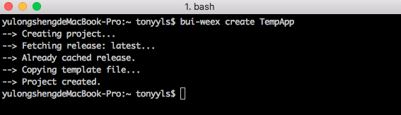

## 创建工程

### 模版工程
使用 bui-weex-toolkit 的create命令来创建模版工程，该工程与 Weex官方的工程有一定差异，主要是 `webpack.config.js` & `package.json` 里面的配置上的不同。

```
bui-weex create <AppName>
```


随后，将安装下来的工程导入到IDE


### 运行工程


### 工程结构


