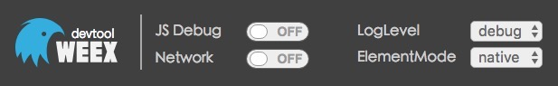

## 开发调试
首先安装 Weex 官方提供的 [Playground](http://weex-project.io/cn/playground.html) ，这是一款安装在手机(Android & iOS）端的 页面预览和调试工具。

`weex-toolkit`中包含了调试工具`weex devtools`，它是专门为Weex定制的一款实现了 Chrome Debugging Protocol 的 inspect/debug 工具，能够帮助你快速查看 app 运行状态和调试 Weex 中的 JS 代码，当前支持 IOS 和 Android 两个平台。

### 启动调试

在命令行输入如下命令：

```
npm run debug 
```
此时会启动调试服务器，并唤起Chrome浏览器的调试主页。调试主页上会有一个二维码，使用 `Playground` App 扫这个二维码可以开启 Playground 调试。


在调试主页上有详细的使用说明，请仔细查看。

### 查看页面结构

使用 Playground 扫描 Weex Preview 上的二维码（这个二维码是我们App启动的首页，要先启动 server）。之后 点击 `Inspector`  查看。 在 `Inspector` 里面能够查看页面的结构，建议选择 `vdom` 来看虚拟dom的结构。




### 调试 Weex 的 JS 代码
调试主页上提供的`Debugger`是用来调试Weex的js代码，能够设置断点，查看调用栈等。

