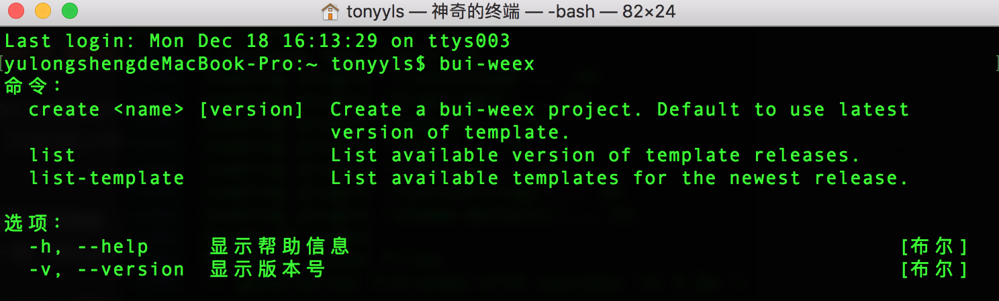
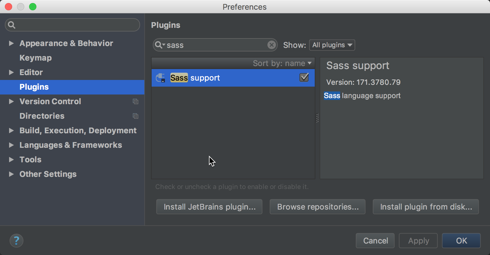
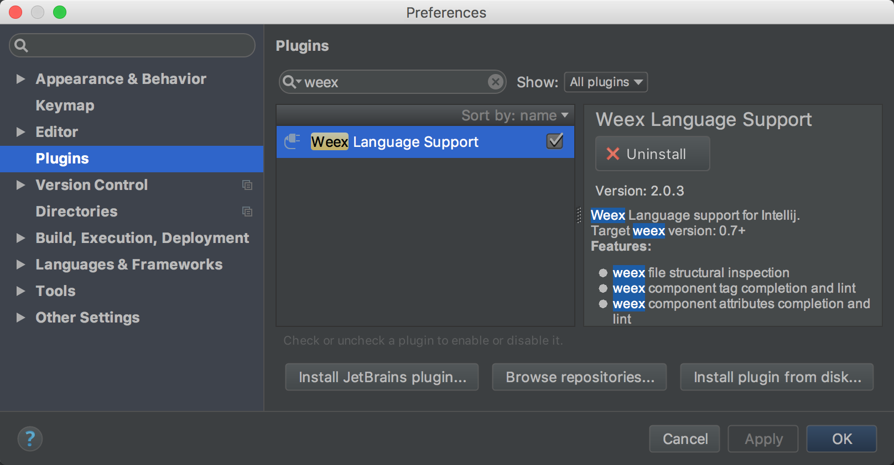
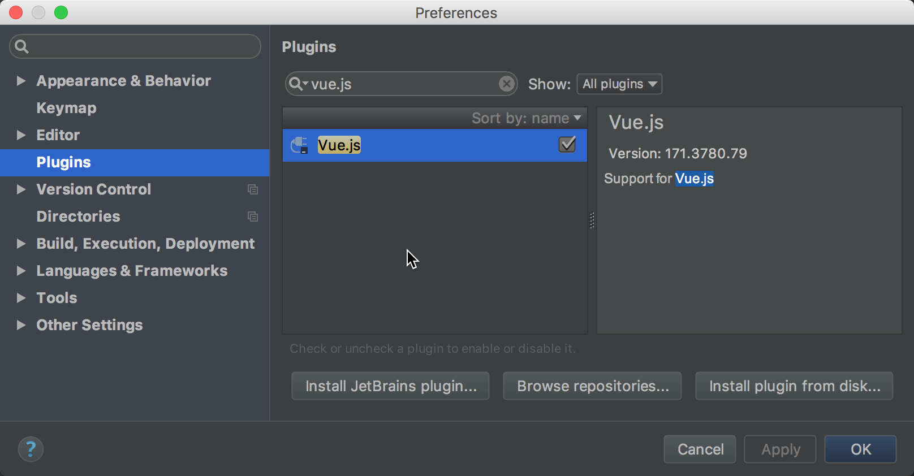

## 环境搭建
假设已经按照 [Weex官方](http://weex-project.io/cn/guide/set-up-env.html) 的教程学会了如何搭建本地开发环境进行 Weex 开发。

### 第一步：安装 bui-weex-toolkit
bui-weex-toolkit 是配合 BUI-Weex 框架使用的命令行工具(CLI)，能够快速创建框架脚手架工程、查看发布版本等。该工具需要安装在全局：

``` bash 
npm install -g bui-weex-toolkit

```
正常安装后，打开命令行，输入`bui-weex`



命令行使用：

```
bui-weex -v // 查看当前toolkit版本
bui-weex -h // 命令帮助信息
bui-weex create <projectName> [version] // 创建bui-weex示例工程，可以指定模版版本
bui-weex list // 显示可用的版本
bui-weex list-template // 显示模版工程里可用的模版

```
更新工具：

```
npm update -g bui-weex-toolkit
```

### 第二步：安装IDE
这里推荐使用对于命令行集成的比较好的IDE，例如 [WebStorm](https://www.jetbrains.com/webstorm/) 和 [Visual Studio Code](https://code.visualstudio.com/) , 以 WebStorm 为例。

WebStorm中安装 VueJS \ Weex \ Sass 的插件：





好了，到这一步，您已经具备了比较优雅的开发环境了，下一步开始【创建工程】！


