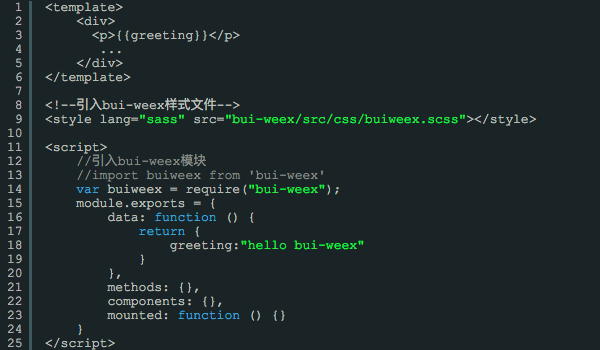

## 页面结构

### 基础结构
每一个vue页面（组件）的结构都包含了`template` `script` `style` 如下结构:

注意事项：

1.	template 下面只能有一个顶级`div`标签
2. buiweex.scss 样式文件的引入 需要带上 `lang="sass"`，业务层面的css推荐使用scss来编写

### 页面滚动结构
要让页面的某部分区域滚动，需要用到 `scroller` 标签。该标签的使用请查看 [【scroller】](http://weex-project.io/cn/references/components/scroller.html)

以上页面结构表示 除了 `bui-header` 外，其余部分滚动显示。如果页面使用了 `list`组件，则无需使用 `scroller` 标签也能达到滚动效果。

### 页面选项卡结构

要让app呈现选项卡的结构，需要用到框架的 `bui-tabbar` 组件，使用该组件大致结构如下，请参考 [【bui-tabbar】](http://localhost:4000/kai-fa-shou-ce/xuan-xiang-536128-bui-tabbar.html)：

更多页面结构，后面会以案例和场景的方式呈现给各位！