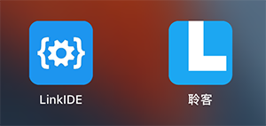
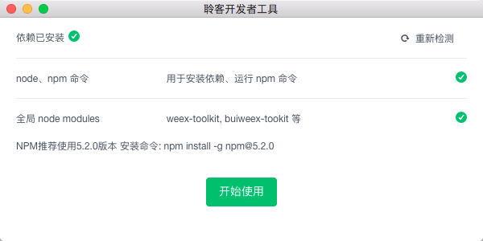
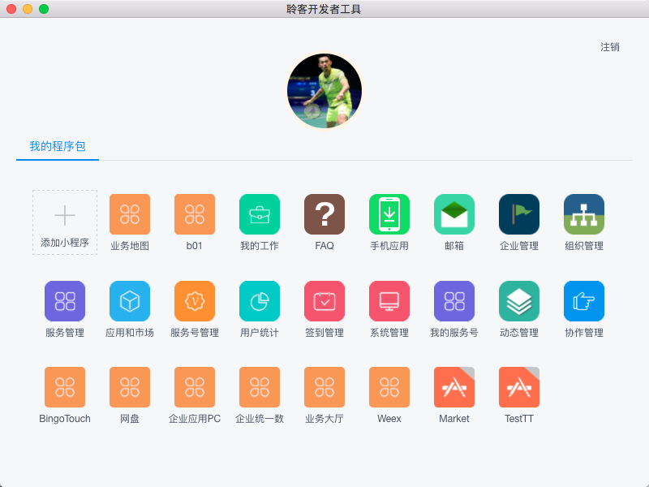
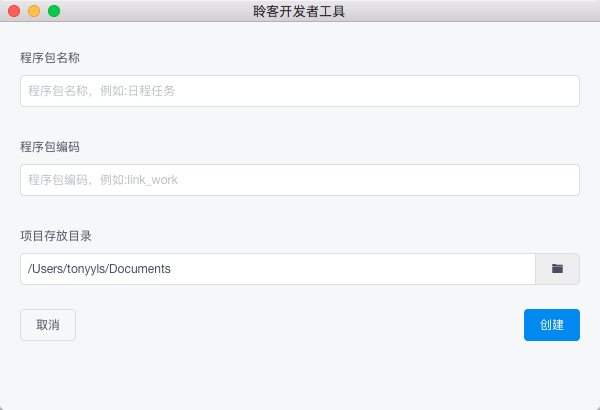
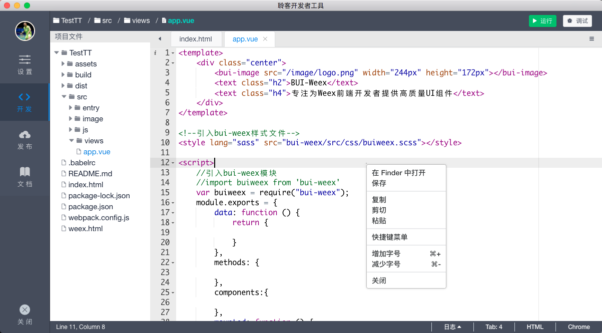
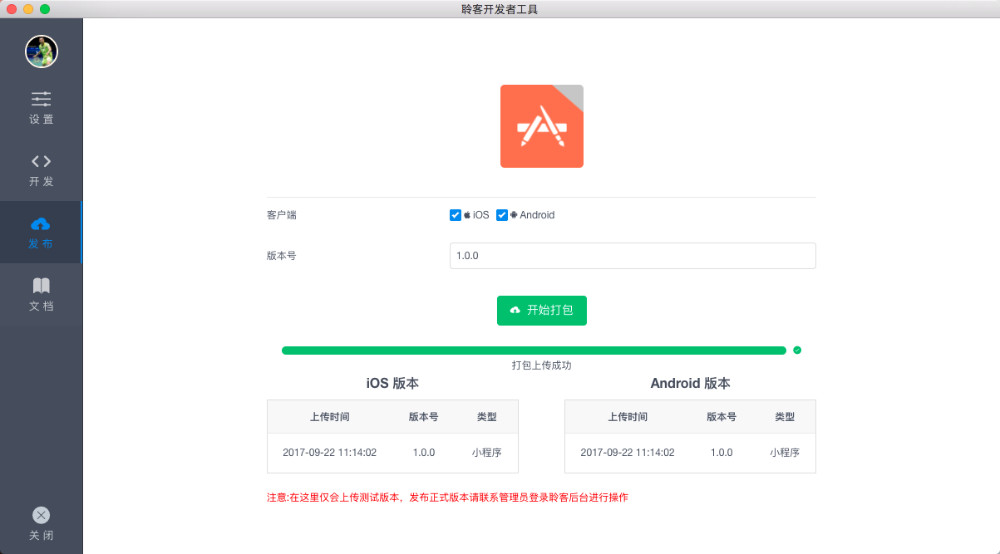

## LinkIDE 开发者工具

为帮助开发者更方便、高效的开发和调试基于`聆客`(Link)的小程序，平台推出了`LinkIDE`，它是一个桌面应用，支持在 windows 和 Mac 上使用，通过打通上层的 `Link 平台` 和底层的 `BUI-Weex 开发框架`，使得开发者可以通过 LinkIDE 管理程序包，便捷的进行开发和调试。



### 程序包 & 应用
这里试图为开发者解释 Link平台 中两个关键的概念：

**程序包**：是指程序源码，每个程序包可以分为`android端`、`iOS端`、`网页端`，每个端下面可以独立发布版本。（程序包 > 终端 > 终端版本）

**应用**：基于程序包组装应用，一个程序包可以包装成为多个应用（通过入口、启动参数等方式进行区分）

其中程序包管理是面向开发者(Developer),应用管理是面向 管理者或者运维人员 (Admin)，一个应用的发布需要得到审核，允许发布后才能正式发布到生产环境。

### 安装包下载

[【Windows版本下载】]()[【Mac版本下载】]() （内测中，暂不对外提供）

### 安装依赖
`LinkIDE` 本身基于 Node,NPM环境，小程序工程模版的创建和运行基于 `weex-toolkit` 和 `buiweex-toolkit`(npm package安装在全局),它会在初次使用的时候检测相关依赖。



如果 node modules 安装失败，还可以尝试手动安装(打开cmd(win) 或者 终端(mac))：

```
npm install -g weex-toolkit bui-weex-toolkit weex-devtool
```
或者

```
cnpm install -g weex-toolkit bui-weex-toolkit weex-devtool
```

### 开发者登录

开发者需要使用 `聆客`手机端的`扫一扫`功能，扫描二维码进行登录。


### 我的程序包

在这里可以看到当前开发者所在企业的所有程序包



### 添加小程序



### 开发调试小程序



### 发布小程序



尽情享受编码乐趣吧!