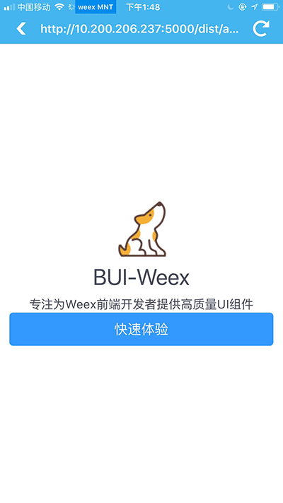

## 创建工程

### 模版工程
使用 bui-weex-toolkit 的 create 命令来创建模版工程，该工程与 Weex官方的工程有一定差异，主要是 `webpack.config.js` & `package.json` 里面的配置上的不同。

```
bui-weex create <AppName>
```


随后，将安装下来的工程导入到IDE，如下所示：


### 运行工程

创建的工程是标准的webpack工程，运行该工程有两种方式：

**方式一：使用命令行运行**

首先，编译文件和启动监听,运行该命令会在根目录下生成 dist 文件夹, 里面生成的文件由 webpack.config.js 里面的脚本决定。

```
npm run dev 
```

随后，启动Server,默认的端口是 8686 ，如果已经被其他程序占用，配置成其他即可。

```
npm run serve 
```

**方式二：使用IDE的可视化命令**

在webstorm中，找到npm的面板，选择命令双击运行：


这里提供了丰富的管理功能，可以方便的 启动、关闭命令


### 预览页面

此时，可以在Chrome中输入 `http://localhost:8686 ` 进行预览


随后，在Weex的`Playground`中预览该页面




