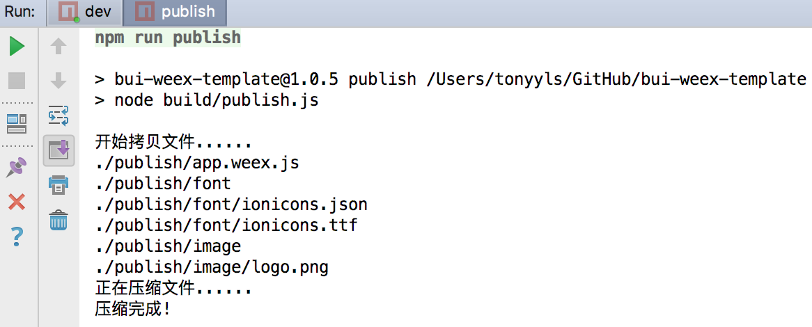

## 打包Bundle

假设已经开发好了应用，即将到提供给 WeexSDK 运行。那么我们需要生成对应的 Bundle JS 。框架提供了便捷的命令生成 Bundle JS 和 相关资源。请参考 [【工作原理】](http://weex-project.io/cn/guide/intro/how-it-works.html)


## 打包

运行 publish 命令，该命令会从dist目录中抽取出提供给 android 和 iOS平台用的 Bundle资源 。在工程根目录下生成 `publish` 文件夹，里面便是最后打包出来的Bundle资源，里面只保留了 `*.weex.js`。

``` bash
npm run pubsh

```

打开publish目录：


