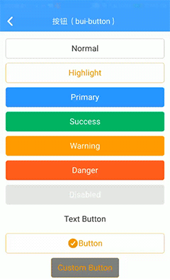
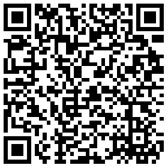

## 按钮 \(bui-button\)

&nbsp;&nbsp;&nbsp;

### 用法

```html
<bui-button value="Normal"></bui-button>
<bui-button type="highlight" value="Highlight"></bui-button>
<bui-button type="primary" value="Primary"></bui-button>
<bui-button type="success" value="Success"></bui-button>
<bui-button type="warning" value="Warning"></bui-button>
<bui-button type="danger" value="Danger"></bui-button>
<bui-button disabled=true   value="Disabled"></bui-button>
<bui-button type="text" value="Text Button"></bui-button>

```
Example: [bui-button](https://github.com/bingo-oss/bui-weex-sample/blob/master/src/views/example/button-demo.vue)

### 属性

| Prop | Type | Required | Default | Description |
| ---- |:----:|:---:|:-------:| :----------:|
| **`value`** | `string` | `Y` |  | 按钮文字 |
| **`type`** | `string` | `N` | `default` | 按钮类型  `default`/ `text`/`highlight`/`primary` /`success`/`warning`/`danger`|
| **`disabled`** | `bool` | `N` | `false` | 按钮不可用 |
| **`btnStyle`** | `object` | `N` | `{}` | 按钮样式扩展对象 |
| **`textStyle`** | `object` | `N` | `{}` | 按钮文本样式扩展对象 |

### 事件

支持 `@click`事件 和 `@longpress`事件 