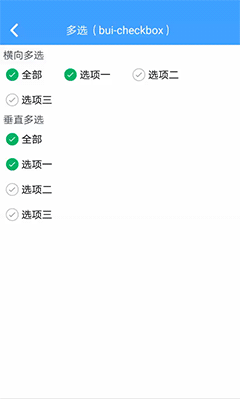
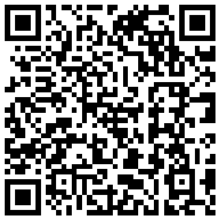

## 复选 (bui-checkbox)

&nbsp;&nbsp;&nbsp;


### 用法

```html
<bui-checkbox v-model="selectedValue" @change="changeValue"  direction="vertical" :items="items"></bui-checkbox>
```

```javascript
data () {
    return {
        selectedValue:["1","2"],
        items:[
            {value:"1",title:'全部'},
            {value:"2",title:'选项一'},
            {value:"3",title:'选项二'},
            {value:"4",title:'选项三'}
        ]
    }
},
methods: {
    changeValue(value){
        this.$toast(JSON.stringify(value));
    }
}

```
Example: [bui-checkbox](https://github.com/bingo-oss/bui-weex-sample/blob/master/src/views/example/checkbox-demo.vue)

### 属性

| Prop | Type | Required | Default | Description |
| ---- |:----:|:---:|:-------:| :----------:|
| **`value`** | `array` | `Y` |  | 可使用`v-model`双向绑定数据 |
| **`items`** | `array` | `Y` |  | 数据项|
| **`direction `** | `string` | `N` | `horizontal` | 方向: `horizontal vertical` |
| **`fontSize`** | `number` | `N` | `48` | 大小 |
| **`iconSize`** | `number` | `N` | `32` | 大小 |
| **`selectedColor`** | `string` | `N` | `#00cc66` | 颜色 |
| **`unSelectedColor`** | `string` | `N` | `#9ea7b4` | 颜色 |

`items`: 赋值单选组数据列表，传一个数组，单个数组的属性如下：
  * value ：单选项值
  * title ：单选项文本
  * disabled ：表明是否激活按钮, true为激活、false为不激活、默认值为false

### 事件

* `@change` ：选中时触发的事件，返回选中的value，它是一个数组


