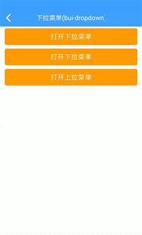
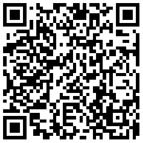

## 下拉菜单 (bui-dropdown)

&nbsp;&nbsp;&nbsp;


### 用法

下拉框的位置是根据触发元素的 event对象的 position 计算而来的。设置ref是为了在组件内部做动画效果。

```html
<div class="center" style="padding: 10px">
    <bui-button type="warning" value="打开下拉菜单" @click="open"></bui-button>
</div>
<bui-dropdown v-model="showDropdown" ref="dropdown" :center=true>
    <bui-cell title="娱乐新闻"></bui-cell>
    <bui-cell title="体育新闻"></bui-cell>
    <bui-cell title="社交媒体"></bui-cell>
</bui-dropdown>
```

```javascript
data: function () {
    return {
        showDropdown: false
    }
},
methods: {
    open(event) {
        this.showDropdown = true;
        this.$refs.dropdown.show(event);
    },
    centerClick(e){
        this.showDropdown = true;
        this.$refs.dropdown.show(e);
    }
}

```
Example: [bui-dropdown](https://github.com/bingo-oss/bui-weex-sample/blob/master/src/views/example/dropdown-demo.vue)

### 属性

| Prop | Type | Required | Default | Description |
| ---- |:----:|:---:|:-------:| :----------:|
| **`value`** | `boolean` | `N` |  | 可以使用v-model进行双向绑定 |
| **`bgColor`** | `string` | `N` | `#ffffff` | 背景颜色 |
| **`center`** | `boolean` | `N` | `false` | 箭头显示位置,false表示在左边，true在中间 |
| **`autoWidth`** | `boolean` | `N` | `true` | 自动适配触发控件宽度，false时候固定260px|


### 方法

* `show` 打开组件，需要把event对象传入：

```javascript
methods: {
    open(event) {
        this.showDropdown = true;
        this.$refs.dropdown.show(event);//dropdown是组件的ref
    },
    centerClick(e){
        this.showDropdown = true;
        this.$refs.dropdown.show(e);
    }
}
```

* `hide` 关闭组件

```javascript
cellClick(){
    this.$refs.dropdown.hide();
},
```
