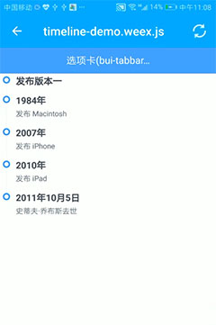

## 流程图 (bui-flow | bui-timeline)

* `bui-flow`固定布局

&nbsp;&nbsp;&nbsp;


* `bui-timeline`可扩展布局

&nbsp;&nbsp;&nbsp;


### 用法

```html
<bui-flow
    :items="testData"></bui-flow>
<bui-flow
    :items="testData"
    :customStyles="customStyles"
    @click='_click'></bui-flow>
    
<bui-timeline>
    <bui-timeline-item first=true></bui-timeline-item>
    <bui-timeline-item>
        <text class="time">1984年</text>
        <text class="content">发布 Macintosh</text>
    </bui-timeline-item>
    <bui-timeline-item>
        <text class="time">2007年</text>
        <text class="content">发布 iPhone</text>
    </bui-timeline-item>
    <bui-timeline-item>
        <text class="time">2010年</text>
        <text class="content">发布 iPad</text>
    </bui-timeline-item>
    <bui-timeline-item last=true>
        <text class="time">2011年10月5日</text>
        <text class="content">史蒂夫·乔布斯去世</text>
    </bui-timeline-item>
</bui-timeline>    
```

```javascript
data: function () {
    return {
        testData: [
            {
                'date': '2017-05-24 21:10:29',
                'desc': '结束',
                'highlight': true,
                'title': '页面交互输出'
            },
            {
                'date': '2017-05-24 21:10:29',
                'desc': '回流到客户确认',
                'title': '设计稿上传'
            },
            {
                'date': '2017-05-24 19:54:28',
                'desc': '产品经理需跟业务与设计相关人员确认',
                'title': '产品经理确认'
            },
            {
                'date': '2017-05-24 19:50:21',
                'desc': '以需求方案输出产品原型,需要客户确认',
                'title': '产品原型图'
            },
            {
                'date': '2017-05-24 19:49:03',
                'desc': '业务员根据客户的需要制定产品解决方案',
                'title': '客户提出需求方案'
            }
        ],
        customStyles: {
            'highlightTitleColor': '#EE9900',
            'highlightPointInnerColor': '#EE9900',
            'highlightPointBorderColor': '#FFE78D'
        },
    }
},
methods: {
    _click(index){
        this.$toast(index);
    },
}
```

Example:[bui-flow](https://github.com/bingo-oss/bui-weex-sample/blob/master/src/views/example/flow-demo.vue)

### 属性
* `bui-flow`

| Prop | Type | Required | Default | Description |
| ---- |:----:|:---:|:-------:| :----------:|
| **`items`** | `array` | `Y` |  | 流程图数据项 |
| **`customStyles`** | `object` | `N` |  | 自定义属性 |

* `bui-timeline`

| Prop | Type | Required | Default | Description |
| ---- |:----:|:---:|:-------:| :----------:|
| **`color`** | `string` | `N` | `blue` | 圆圈颜色，可选值为`blue``red``green`，或自定义色值 |
| **`title`** | `string` | `N` | `发布版本一` | 默认时间轴文本 |
| **`last`** | `boolean` | `Y` | `false` | 指定最后一个节点 |
| **`first`** | `boolean` | `Y` | `false` | 指定第一个节点 |

`items`: 赋值单选组数据列表，传一个数组，单个数组的属性如下：

  * title ：节点文本
  * date ：节点时间
  * desc ：节点描述
  * highlight ：表明该选项是否为节点高亮, true为流程图节点高亮、false为流程图节点不高亮、默认值为false


`customStyles `: 自定义属性，传一个对象，属性如下：

  * lineColor ：线条色
  * pointInnerColor ：正常节点背景色
  * pointBorderColor ：正常节点边框色
  * highlightTitleColor ：高亮状态文字色
  * highlightPointInnerColor ：高亮状态节点背景色
  * highlightPointBorderColor ：高亮状态节点边框色

### 事件

* `@click`:点击某项触发的事件，返回索引。`bui-flow`特有

### `bui-timeline`的扩展

自定义时间轴点内容，参考如下：

```html
<bui-timeline title="">
    <bui-icon name="trophy" slot="dot"></bui-icon>
    <text class="time">1984年</text>
    <text class="content">发布 Macintosh</text>
</bui-header>
```