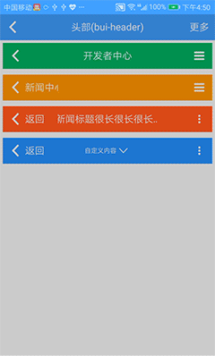
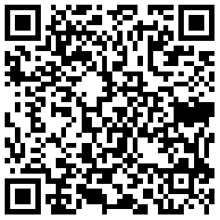

## 标题栏 \(bui-header\)

&nbsp;&nbsp;&nbsp;


### 用法

```html
<bui-header title="标题栏" :leftItem="leftItem" :rightItem="rightItem" 
@leftClick="back" @rightClick="rightclick" @centerClick="centerclick">
</bui-header>
```

```javascript
export default {
    data: function () {
        return {
            leftItem: {
                icon: 'ion-chevron-left',
            },
            rightItem: {
                text: '更多'
            }
        }
    },
    methods: {
        "back": function () {
            this.$pop();
        },
        "rightclick": function () {
            this.$toast('right')
        },
        "centerclick": function () {
            this.$toast('center')
        }
    }
}

```
Example:[bui-header](https://github.com/bingo-oss/bui-weex-sample/blob/master/src/views/example/header-demo.vue)


### 属性

| Prop | Type | Required | Default | Description |
| ---- |:----:|:---:|:-------:| :----------:|
| **`title`** | `string` | `N` |  | 标题文本 |
| **`leftItem`** | `object` | `N` | defaultItem | 左边显示内容|
| **`rightItem`** | `object` | `N` | defaultItem | 右边显示内容|
| **`textColor`** | `string` | `N` | `#ffffff` | 字体颜色 |
| **`iconColor`** | `string` | `N` | `#ffffff` | 图标颜色 |
| **`iconSize`** | `string` | `N` | `48px` | 图标大小|
| **`backgroundColor`** | `string` | `N` | `#4ca4fe` | 背景颜色 |
| **`height`** | `string` | `N` | `90px` | 头部高度 |
| **`useDefaultReturn`** | `Boolean` | `N` | `true` | 是否使用默认的返回 |

defaultItem = `{ icon: '',text: ''}` ,其中 icon 是字体图标的name，从ionicons寻找合适的进行填充，text是文本内容，例如'返回'，icon在左，text在右。

### 事件

支持 `@leftClick`（左） `@rightClick`（右） `@centerClick`（中） 事件


### 扩展

标题栏左中右需要自定义内容时，可通过 `slot` 区分，`right` 是右侧 ，`left` 是左侧, `center` 中间，参考如下：

```html
<bui-header title="">
    <div slot="center">
    ...
    </div>
</bui-header>
```
