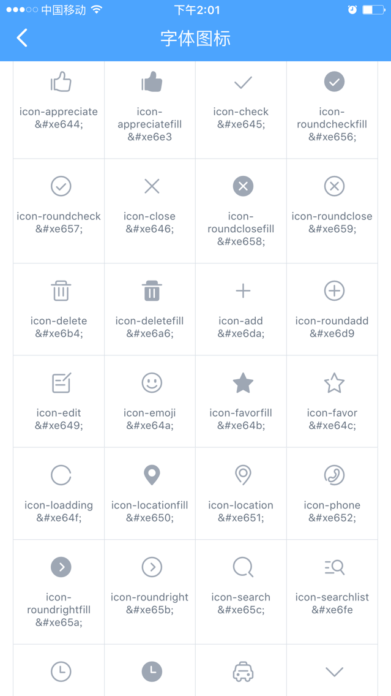

# 字体图标 \(bui-icon\)

注意：该组件在mixins里已经引入，用时勿再引。

目前已有221个字体图标，key，value格式，value是字体图标对应的unicode，图标列表如下：

```
"icon-appreciate": "&#xe644;",
"icon-appreciatefill": "&#xe6e3",
"icon-check": "&#xe645;",
"icon-roundcheckfill": "&#xe656;",
"icon-roundcheck": "&#xe657;",
"icon-close": "&#xe646;",
"icon-roundclosefill": "&#xe658;",
"icon-roundclose": "&#xe659;",
"icon-delete": "&#xe6b4;",
"icon-deletefill": "&#xe6a6;",
"icon-add": "&#xe6da;",
"icon-roundadd": "&#xe6d9",
"icon-edit": "&#xe649;",
"icon-emoji": "&#xe64a;",
"icon-favorfill": "&#xe64b;",
"icon-favor": "&#xe64c;",
"icon-loadding": "&#xe64f;",
"icon-locationfill": "&#xe650;",
"icon-location": "&#xe651;",
"icon-phone": "&#xe652;",
"icon-roundrightfill": "&#xe65a;",
"icon-roundright": "&#xe65b;",
"icon-search": "&#xe65c;",
"icon-searchlist": "&#xe6fe",
"icon-time": "&#xe65f;",
"icon-timefill": "&#xe65e;",
"icon-taxi": "&#xe65d;",
"icon-unfold": "&#xe661;",
...
```



使用时设置的`name`值是上图对应的key，参考如下：

```
<bui-icon name="icon-search"></bui-icon>
```

## 颜色设置

组件支持设置color属性，默认颜色是深灰色'\#9ea7b4'，参考如下：

```
<bui-icon name="icon-search" color="red"></bui-icon>
```

## 大小设置

组件支持设置size属性，默认大小是'40px'，参考如下：

```
<bui-icon name="icon-search" size="60px"></bui-icon>
```

## 可添加样式类

组件支持设置类class，参考如下：

```
<bui-icon name="icon-search" size="60px" class="margin10"></bui-icon>
```

## 横向字体图标排列

需要在外层增加`flex-row`使其水平铺开，相反纵向在外层加`flex-column`

```
<div class="flex-row">
     <bui-icon name="icon-search" size="60px"></bui-icon>
     <bui-icon name="icon-search" size="60px"></bui-icon>
</div>
```

## 字体图标事件

按钮支持：点击事件@click

```
<bui-icon name="icon-search" size="60px" class="margin10" @click="iconEvent($event)"></bui-icon>
```

```js
methods: {
   "iconEvent": function (event) { 
        //todo;
    }
}
```

## 扩展组件

参照bui-icon组件另外创建一个，注意事项有2个，如下：

1. fontFamily的值命名要跟已有的字体图标的取名不同，如下图：
2. 如果是用把字体文件存放在项目文件里，字体文件存放目录在 'src/font' 文件里，需要在webpack.config.js编译文件里将字体图标文件拷贝到dist/目录下，如下图：

   


