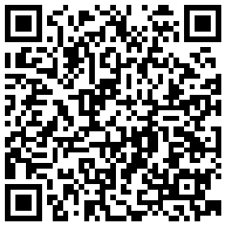

## 字体图标 \(bui-icon\)

框架基于开源字体图标库：[http://ionicons.com/](http://ionicons.com/)

&nbsp;&nbsp;&nbsp;


### 用法

```html
<bui-icon name="ion-ios-bell" size=60></bui-icon>
```
Example:[bui-icon](https://github.com/bingo-oss/bui-weex-sample/blob/master/src/views/example/icon-demo.vue)
### 属性

| Prop | Type | Required | Default | Description |
| ---- |:----:|:---:|:-------:| :----------:|
| **`name`** | `string` | `Y` |  | 名称,来源于ionicons |
| **`color`** | `string` | `N` | `#9ea7b4` | 颜色|
| **`size`** | `number` | `N` | `48` | 大小 |

### 事件

支持 `@click`事件

### 查找

<iframe src="http://dev.bingocc.com/bui-weex-icon/index.html" style="border:none;width:100%;height:12000px">

