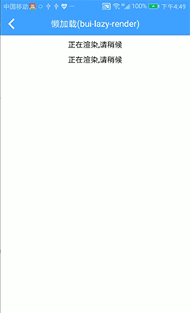

## 懒加载组件 \(bui-lazy-render\)

&nbsp;&nbsp;&nbsp;


### 用法

```html
 <bui-lazy-render time=1000>
    <bui-panel title="延迟1s出来" type="warning" border="1">
        <bui-image style="width: 260px;height: 260px;" src="/image/demo.png"></bui-image>
    </bui-panel>
</bui-lazy-render>

```

Example: [bui-lazy-render](https://github.com/bingo-oss/bui-weex-sample/blob/master/src/views/example/lazy-render-demo.vue)

### 属性

| Prop | Type | Required | Default | Description |
| ---- |:----:|:---:|:-------:| :----------:|
| **`tip `** | `string` | `N` | `正在渲染,请稍候` | 提示文本 |
| **`time`** | `number` | `N` | `10` | 单位ms |

### 事件

* `@loaded` 组件加载完成后的事件