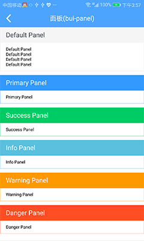

## 面板 (bui-panel)

&nbsp;&nbsp;&nbsp;


### 用法

```html
<bui-panel title="Default Panel"><text>Default Panel</text></bui-panel>
<bui-panel title="Primary Panel" type="primary" border="1"><text>Primary Panel</text></bui-panel>
```

填充slot

```html
<bui-panel title="Default Panel" border="1">
    <text>Default Panel</text>
    <text>Default Panel</text>
    <text>Default Panel</text>
    <text>Default Panel</text>
</bui-panel>

```

Example:[bui-panel](https://github.com/bingo-oss/bui-weex-sample/blob/master/src/views/example/panel-demo.vue)

### 属性

| Prop | Type | Required | Default | Description |
| ---- |:----:|:---:|:-------:| :----------:|
| **`type`** | `string` | `N` | `default` | 面板风格 `default`/`primary `/`success `/`info`/`warning`/`danger` |
| **`title`** | `string` | `N` |  | 面板标题|
| **`paddingBody`** | `number` | `N` | 20 | body补白 |
| **`paddingHead`** | `number ` | `N` | 20 | header补白 |
| **`border`** | `number` | `N` | 0 | 边框宽度|
  


