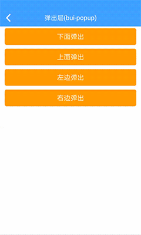

## 弹出层 (bui-popup)

&nbsp;&nbsp;&nbsp;

### 用法

```html
 <div class="center" style="padding:10px;">
    <bui-button class="ex-btn" type="warning" value="下面弹出" @click="open1()"></bui-button>
    <bui-button class="ex-btn" type="warning" value="上面弹出" @click="open2()"></bui-button>
    <bui-button class="ex-btn" type="warning" value="左边弹出" @click="open3()"></bui-button>
    <bui-button class="ex-btn" type="warning" value="右边弹出" @click="open4()"></bui-button>
</div>

<bui-popup v-model="showPopup1" height="300">
    <text class="h4">下方弹出内容</text>
</bui-popup>

<bui-popup v-model="showPopup2" pos="top" backgroundColor="#ff9900" height="300">
    <text class="h4">上面弹出内容</text>
</bui-popup>

<bui-popup v-model="showPopup3" pos="left" backgroundColor="#ff4e24" width="300">
    <text class="h4">左边弹出内容</text>
</bui-popup>

<bui-popup v-model="showPopup4" pos="right" width="300">
    <text class="h4">右边弹出内容</text>
</bui-popup>
```

```javascript
data: function () {
    return {
        showPopup1: false,
        showPopup2: false,
        showPopup3: false,
        showPopup4: false,
    }
},
methods: {
    open1() {
        this.showPopup1 = true;
    },
    open2() {
        this.showPopup2 = true;
    },
    open3() {
        this.showPopup3 = true;
    },
    open4() {
        this.showPopup4 = true;
    }
}

```
Example: [bui-popup](https://github.com/bingo-oss/bui-weex-sample/blob/master/src/views/example/popup-demo.vue)

### 属性

| Prop | Type | Required | Default | Description |
| ---- |:----:|:---:|:-------:| :----------:|
| **`value`** | `boolean` | `Y` |  | 可以使用v-model进行双向绑定 |
| **`pos`** | `string` | `N` | `bottom` | 弹出的位置：bottom/left/right/top |
| **`backgroundColor`** | `string` | `N` | `#ffffff` | 背景颜色 |
| **`height`** | `number` | `N` | `840` | 弹出高度 |
| **`width`** | `number` | `N` | `750` | 弹出宽度|
