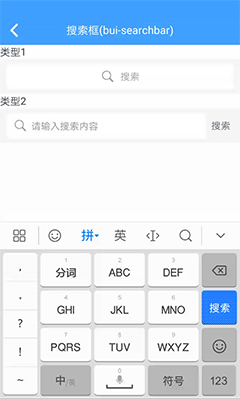
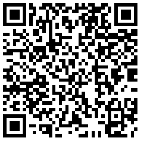

## 搜索框 (bui-searchbar)

框架提供两个搜索框布局，一个是搜索位于中间布局 `bui-searchbar-center` ，一个是搜索位于左边布局 `bui-searchbar-left`。

&nbsp;&nbsp;&nbsp;

### 用法

```html
<bui-searchbar-center  placeholder="请输入关键字" @search="onSearch"></bui-searchbar-center>

<bui-searchbar-left @search="onSearch" :autofocus=true></bui-searchbar-left>

```

```javascript
onSearch(value){
    this.$toast(value);
}
```
Example: [bui-searchbar](https://github.com/bingo-oss/bui-weex-sample/blob/master/src/views/example/searchbar-demo.vue)

### 属性

| Prop | Type | Required | Default | Description |
| ---- |:----:|:---:|:-------:| :----------:|
| **`placeholder `** | `string` | `N` | `请输入搜索内容` | 输入提示内容 |
| **`value `** | `string` | `N` |  | 输入框文本 |
| **`autofocus `** | `boolean` | `N` | `false` | 自动聚焦 |

### 事件

* `@focus` 是搜索框组件获得输入焦点时候的事件
* `@blur` 是搜索框失去输入焦点时候的事件
* `@clear` 是清除搜索框内容时触发的事件
* `@search` 是搜索框点击搜索按钮后触发的事件

