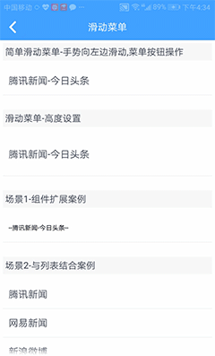

## 滑动菜单 (bui-swipe-cell)

&nbsp;&nbsp;&nbsp;


### 用法

```html
<text class="h4 titleEx">简单滑动菜单-手势向左边滑动,菜单按钮操作</text>
<bui-swipe-cell @clickmenu="clickmenu"
    :items="btnAry1"
    :title="'阿农之家'"></bui-swipe-cell>
<text class="h4 titleEx mT50">滑动菜单-高度设置</text>
<bui-swipe-cell @clickmenu="clickmenu"
    :height="'150px'"
    :items="btnAry1"
    :title="'千手观音剁手'"></bui-swipe-cell>
<text class="h4 titleEx mT50">场景1-组件扩展案例</text>
<bui-swipe-cell :items="btnAry1"
    :title="'樊登读书会'">
<text slot="content">--扩展部分--</text>
</bui-swipe-cell>
<text class="h4 titleEx mT50">场景2-与列表结合案例</text>
<div v-for="(i, index) in items" :key="index">
<bui-swipe-cell :items="btnAry"
        :title="i.title"
        :index="index"
        ref="swipebtn"
        @swipe="setkey"
        @click="closeswipe"></bui-swipe-cell>
</div>
```

```javascript
data: function () {
    return {
        btnAry1: [
	        {
	            'title': '取消',
	            'bgcolor' : '#c6c7c8'
	        },
	        {
	            'title': '标记',
	            'bgcolor' : '#3399ff'
	        }
	    ],
	    btnAry: [
	        {
	            'title': '取消',
	            'bgcolor' : '#c6c7c8'
	        },
	        {
	            'title': '删除',
	            'bgcolor' : '#fa3300'
	        },
	        {
	            'title': '标记',
	            'bgcolor' : '#3399ff'
	        }
	    ],
	    items: [
	        {
	            'title':'行无止尽'
	        },
	        {
	            'title':'柠檬'
	        },
	        {
	            'title':'樊登读书会'
	        },
	        {
	            'title':'云应用平台'
	        }
	    ],
	    indexkey: '',
    }
},
methods: {
    clickmenu(e){
        if(e == 0){
            this.$toast(this.btnAry1[e-0].title);
        }else if(e == 1){
            this.$toast(this.btnAry1[e-0].title);
        }
    },
    setkey(e){
        if(this.indexkey.length != 0 && this.indexkey != e) this.$refs.swipebtn[this.indexkey-0].close();
        this.indexkey = e;
    },
    closeswipe(){
        this.$refs.swipebtn[this.indexkey-0].close();
    }
}
```

Example:[bui-swipe-cell](https://github.com/bingo-oss/bui-weex-sample/blob/master/src/views/example/swipe-cell-demo.vue)

### 属性

| Prop | Type | Required | Default | Description |
| ---- |:----:|:---:|:-------:| :----------:|
| **`items`** | `array ` | `Y` | | 滑动菜单按钮数据项 |
| **`title`** | `string ` | `N` | | 左边标题内容 |
| **`height`** | `string ` | `N` | `100px` | 高度 |
| **`index`** | `string` | `N` | | 脚标指数 |

`items`: 赋值单选组数据列表，传一个数组，单个数组的属性如下：

  * title ：按钮文字
  * bgcolor ：按钮背景色
 
 默认值如下：
 
 ```javascript
 [
    {
        'title': '取消',
        'bgcolor' : '#c6c7c8'
    },
    {
        'title': '删除',
        'bgcolor' : '#fa3300'
    }
]
 ```


### 事件

* `@clickmenu`:点击滑动菜单按钮触发的事件，返回按钮的index
* `@click`:点击滑动内容块触发的事件，返回index
* `@swipe`: 向左滑动时触发的事件，返回index