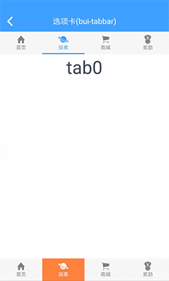
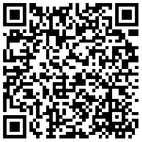
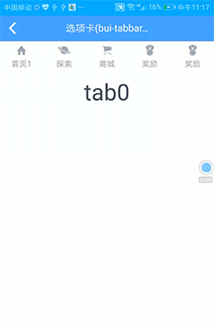
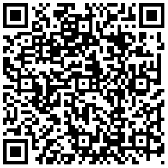

## 选项卡(bui-tabbar | bui-tabbar-scroller)
有两种形式，用法相同，如下：

* bui-tabbar 选项卡

&nbsp;&nbsp;&nbsp;

* bui-tabbar-scroller 横向滚动选项卡

&nbsp;&nbsp;&nbsp;


### 用法

选项卡的实现使用方式：bui-tabbar + slider，充分利用slider的滑动特性。

实现：

* bui-tabbar 通过控制 currentTab(v-model)索引来实现选中效果。
* slider 通过 `@change`事件改变 index 和 currentTab 实现联动。
* 要实现底部选项卡，只需要将 bui-tabbar 和 slider 区域对调即可;

html关键代码如下:

```html
<bui-tabbar :tabItems="tabItems" showSelectedLine=true @change="onItemChange" v-model="currentTab"></bui-tabbar>

<slider class="slider" @change="onSliderChange" :index="currentTab">
    <div class="slider-item">
       <text class="h1">tab0</text>
    </div>
    <div class="slider-item">
        <text class="h1">tab1</text>
    </div>
    <div class="slider-item">
        <text class="h1">tab2</text>
    </div>
    <div class="slider-item">
        <text class="h1">tab3</text>
    </div>
</slider>

```

JS关键代码如下：

```javascript
module.exports = {
    data: function () {
        return {
            leftItem: {
                icon: 'ion-chevron-left'
            },
            currentTab:1,
            tabItems: [
                {
                    title: "首页",
                    icon: "ion-home"
                },
                {
                    icon: "ion-planet",
                    title: "探索"
                },
                {
                    icon: "ion-ios-cart",
                    title: "商城"
                },
                {
                    icon: "ion-ribbon-a",
                    title: "奖励"
                }
            ]
        }
    },
    methods: {
        back() {
            this.$pop();
        },
        onItemChange(index){

        },
        onSliderChange(e){
            var index = e.index;
            this.currentTab=index;
        }
    }
}
```

Example: [bui-tabbar](https://github.com/bingo-oss/bui-weex-sample/blob/master/src/views/example/tabbar-demo.vue)

### 属性
* `bui-tabbar`与`bui-tabbar-scroller`

| Prop | Type | Required | Default | Description |
| ---- |:----:|:---:|:-------:| :----------:|
| **`tabItems `** | `array` | `Y` |  | 选项卡数据（数组），每个item应包含 icon, title 字段 |
| **`value`** | `number` | `Y` |  | 索引,外部使用 v-model |
| **`height`** | `string` | `N` | `100px` | 高度 |
| **`iconSize`** | `string` | `N` | `45px` | 图标大小 |
| **`titleSize`** | `string` | `N` | `22px` | 字体大小 |
| **`background`** | `string` | `N` | `#f7f7f7` | 背景颜色 |
| **`selectedBackground`** | `string` | `N` | `#f7f7f7` | 选中的背景颜色 |
| **`normalColor`** | `string` | `N` | `#818181` | 文字图标默认颜色 |
| **`selectedColor`** | `string` | `N` | `#4ca4fe` | 文字图标选中的颜色 |
| **`borderBottomColor`** | `string` | `N` | `#4ca4fe` | 底部边框颜色 |
| **`showSelectedLine`** | `bool` | `N` | false | 选中项底部显示边框 |
| **`containerStyle`** | `object` | `N` |  | 外层容器扩展样式 |
| **`itemStyle`** | `object` | `N` |  | 每个item扩展样式 |

* `bui-tabbar-scroller`

| Prop | Type | Required | Default | Description |
| ---- |:----:|:---:|:-------:| :----------:|
| **`width`** | `number` | `Y` | `150` | 每个tab的宽度，满屏是width=750/tab个数，滚动屏就width>750/tab个数 |


### 事件

支持 `@change`事件，返回当前选中 item 的 index
