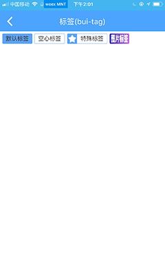
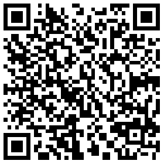

## 标签 (bui-tag)

&nbsp;&nbsp;&nbsp;


### 用法

```html
<bui-tag class="mr10" value="默认标签"></bui-tag>
<bui-tag class="mr10"
         value="空心标签"
         type="hollow"
         closable></bui-tag>
<bui-tag class="mr10" value="特殊标签"
         type="special"
         specialIcon="http://gtms02.alicdn.com/tfs/TB1gC.jRVXXXXaiXFXXXXXXXXXX-32-32.png"
         closable></bui-tag>
<bui-tag value="图片标签"
         type="image"
         img="http://gtms04.alicdn.com/tfs/TB1ZfodRVXXXXciXFXXXXXXXXXX-92-24.png"></bui-tag>
```

Example:[bui-tag](https://github.com/bingo-oss/bui-weex-sample/blob/master/src/views/example/tag-demo.vue)

### 属性

| Prop | Type | Required | Default | Description |
| ---- |:----:|:---:|:-------:| :----------:|
| **`type`** | `string` | `N` | `solid` | 标签的类型（标注1） |
| **`value`** | `string` | `Y` |  | 文字标签的文案 |
| **`tagColor`** | `string` | `N` | `#ff5000` | 标签颜色 |
| **`fontColor`** | `string` | `N` | `#ffffff` | 文字颜色 |
| **`specialIcon`** | `string` | `N` |  | 特殊标签的小icon(注2) |
| **`img`** | `string ` | `N ` | `` | 图片类型tag的图片地址(注3) |

* 注1: type的类型有如下四种solid、hollow、special、image，默认是solid(实心)
* 注2: specialIcon本应该为iconfont的，但是考虑的Weex,直接使用png会更方便
* 注3: type为image时，img字段为必传


