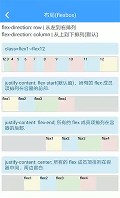
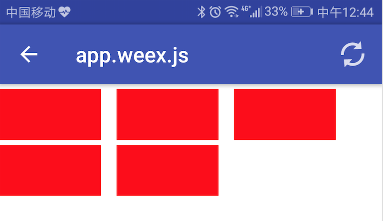

## 布局样式

Weex支持`盒模型`和`Flexbox`布局，都是基于CSS的标准来实现的，但远没有传统CSS那么灵活和好用，也许是受限于android 和iOS 平台原生层面布局能力的影响。在使用 buiweex的 样式之前，请先了解 [【通用样式】](http://weex-project.io/cn/references/common-style.html) [【文本样式】](http://weex-project.io/cn/references/text-style.html) 

### Flex布局

#### 弹性盒子

框架提供了一组class，分别是 `span1 ~ span12`,定义 flex成员可以占用容器剩余空间的大小。注意区别于web层面的12栅格布局，这里仅仅是 原生层面 布局权重(`layout_weight`)的概念。如下图：



```html
<div>
	<div class="span1"></div>
	<div class="span1"></div>
</div>

```
以上代码表示每个成员项占用 一半的空间。


```html
<div>
	<div class="span1"></div>
	<div class="span2"></div>
	<div class="span3"></div>
</div>

```
以上代码表示将父亲容器分成5等分，从左到右分别占用1份，2份，3份。

#### 布局方向

框架提供了 `flex-row` 和 `flex-cloumn` 来控制flex布局方向。另外，也可以通过`flex-fluid` 来达到自动换行（流式布局）的效果。

felx-row: 从左到右排列

```html
<div class="flex-row">
	<div class="span1"></div>
	<div class="span2"></div>
	<div class="span3"></div>
</div>

```

felx-column: 从上到下排列

```html
<div class="flex-column">
	<div class="span1"></div>
	<div class="span2"></div>
	<div class="span3"></div>
</div>

```

flex-fluid: 流式布局,通常成员项是固定宽度

```html
<div class="flex-row flex-fluid">
	<div class="ma"></div>
	<div class="ma"></div>
	<div class="ma"></div>
	<div class="ma"></div>
	<div class="ma"></div>
</div>

<style>
.ma{
	width:200px;
	height:100px;
	margin-right:30px;
	background-color: red;
}
</style>
```
以上代码实现的效果如下：



#### 对齐方式

框架提供了一组class，用于进行布局对齐：

```html
//center in parent
.center{
  justify-content: center;
  align-items: center;
}

//flex-direction:column
.column-center-top{
  align-items: center;
}
.column-center-bottom{
  justify-content: flex-end;
  align-items: center;
}
.column-center-left{
  justify-content: center;
  align-items: flex-start;
}
.column-center-right{
  justify-content: center;
  align-items: flex-end;
}
.column-left-top{
  justify-content: flex-start;
  align-items: flex-start;
}
.column-right-top{
  justify-content: flex-start;
  align-items: flex-end;
}
.column-left-bottom{
  justify-content: flex-end;
  align-items: flex-start;
}
.column-right-bottom{
  justify-content: flex-end;
  align-items: flex-end;
}
.row-space-between{
  justify-content: space-between;
  align-items: center;
}

//flex-direction:row
.row-center-top{
  justify-content:center;
  align-items: flex-start;
}
.row-center-bottom{
  justify-content: center;
  align-items: flex-end;
}
.row-center-left{
  justify-content: flex-start;
  align-items: center;
}
.row-center-right{
  justify-content: flex-end;
  align-items: center;
}
.row-left-top{
  justify-content: flex-start;
  align-items: flex-start;
}
.row-right-top{
  justify-content: flex-end;
  align-items: flex-start;
}
.row-left-bottom{
  justify-content: flex-start;
  align-items: flex-end;
}
.row-right-bottom{
  justify-content: flex-end;
  align-items: flex-end;
}

```